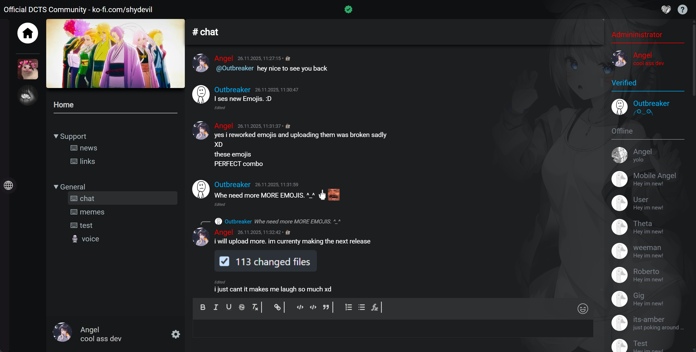

# DCTS - Direct Communication Through Sockets
[Visit our subreddit](https://www.reddit.com/r/dcts/) • [Feature list](https://github.com/hackthedev/dcts-shipping/blob/beta/docs/Feature%20List.md) • [Discord for convenience](https://discord.gg/AYq8hbRHNR) • [Public Instance](https://chat.network-z.com/) • [To-Do list](https://github.com/users/hackthedev/projects/6/views/1?filterQuery=-changelog-status%3AAdded+-status%3ACanceled)

[](https://ko-fi.com/M4M719FPNG) 

This project was made with the goal to provide a platform that aims to fix issues with existing solutions like Discord, TeamSpeak, Revolt, Fosscord, Matrix, TeaSpeak and all others out there and to create new, advanced and easy to use features while creating as little friction as possible and keeping things intuitive.

Although there are still some rough edges and a few missing features, DCTS is evolving rapidly due to the massive amount of work being put into its development. This includes adding new features as well as refining existing ones or improving the general experience. Compared to other alternatives, DCTS is evolving lightning fast.

**If you need help** or wanna reach out to me feel free to create a **post on** the **subreddit**, **message** me **on discord**, or text me **on signal: shydevil.89**.




*(^ this is a custom theme thats shipped too)*

------

## Support the Project <3

Without community support, development may slow down significantly and could even come to a halt over time :(

If you value the vision of DCTS and want to see it grow, consider making a donation. Every contribution helps accelerate development and ensures the project's future. Thank you for helping to keep DCTS alive!

[Donate via PayPal](https://www.paypal.me/devilsstore) | [Donate via Ko-fi](https://ko-fi.com/shydevil)

> [!TIP]
>
> You can also **support the project by** regularly **sharing it and letting** as many **people know**  about it as possible!

------

## Why DCTS?

> [!NOTE]
> DCTS is still in development. Some features may not yet be fully refined.

Modern communication platforms have limitations and issues that DCTS is designed to overcome and fix. Here's why DCTS exists and how it stands out:

- **Encrypted DMs**: DMs are end-to-end encrypted when using the [desktop client](https://github.com/hackthedev/dcts-client-shipping/) and non-encrypted when using the web app as fallback. Despite encryption its possible to report and moderate encrypted messages without compromise![^1]

- **Decentralized In-App Server Discovery**: When using the desktop client, users will share their previously connected servers with the currently connected servers. Servers will sync with other servers and display them seamlessly for both the web and desktop client.

- **Full Data Control**: Self-host your server and take complete control of your data and privacy with ease.

- **Easy to Set Up**: With just two commands (assuming NodeJS & MySQL/MariaDB are installed), you can have your server running.

- **Community-Driven**: Responsive development ensures your feedback and feature requests are heard.

- **Modern and User-Friendly**: Combines a sleek design with an intuitive interface for both casual and advanced users.

- **Highly Customizable**: The plugin system allows endless possibilities for enhancements and features, developed by the community or officially **without** the need of additional hosting.

- **Efficient Media Handling**: Supports advanced features like a Cloudflare image CDN for fast and smooth media uploads and media cache.

- **No Paywalls**: Enjoy full functionality without subscriptions or hidden costs - DCTS is made for everyone.

- **User-Focused**: Designed to prioritize users, not corporations.

- **Future-Proof**: Built with scalability and future features in mind.

- **Rapid Development**: Fast bug resolution, continuous feature delivery, and ongoing improvements enabled by a modern and efficient tech stack.

- **Custom Themes**: You can select custom themes the server has to offer, two example themes included on default and with accent color support.

- **Account Export**: You can export your account and easily re-import it when needed.

While DCTS is an app, its going to be part of a bigger ecosystem that i plan to create in order to make the web a better place because we still need proper alternatives in other areas too.

> [!TIP]
>
> Checkout the Feature list in `/docs/Feature List.md` if you're curious about more

------

## Installing

### Docker
#### Quick Start :
If you want to get started quickly, you can use this interactive setup script to automatically create the Docker Compose setup: [soon]

#### Manually (compose/run) :
Alternatively, you can install DCTS manually using docker compose or docker run. See the full documentation here: Install with Docker

### Installer Script

In order to make the install experience as easy as possible i've tried to make a complete auto installer script that installs and configurates everything thats needed to run an instance.

##### Tested with

- Debian 13

> [!CAUTION]
>
> The installer script is designed to be used on a new system. It uses caddy and will completely replace the caddy config file in `/etc/caddy/` the first time it runs. Once docker is available i recommend using that.

> [!NOTE]
>
> If you want to manually install DCTS checkout the `docs` folder, specifically `Getting started` and `VoIP Setup`.

> [!IMPORTANT]
>
> You will need to setup your domain DNS records first! Example records:
>
> - Chat » chat.your-domain.com
> - Voip » lk.chat.your-domain.com

```bash
# Auto Installer Script that installs and configurates EVERYTHING 
apt install curl -y && curl -sSL https://raw.githubusercontent.com/hackthedev/initra-shipping/refs/heads/main/apps/dcts/install.sh | bash -s -- --create-instance "Test Server 1" --port 2000 --domain chat.your-domain.com --beta
```

Once **successfully** executed, your instance should be available at `chat.your-domain.com:2000` with working voice chat and **everything**. you can access the server console with `screen -x dcts_testserver1` with this example.

------

## Tested Node Versions
- ✔️ v21.7.3
- ✔️ v20.19.2
- ✔️ v18.20.2
- ✔️ v16.16.0
- 🚫 v12.22.9

[^1]: When user A sends user B a message, only user A and B can decrypt the message. When user B reports the message sent by user A, user B creates a report with the encrypted data and decrypted message. Based on the decrypted plain text from user B and public key from user A, its possible to verify the encrypted data by any third party, tho only user A and B can actually decrypt it.
