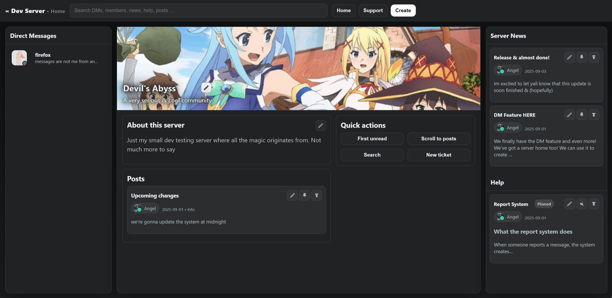
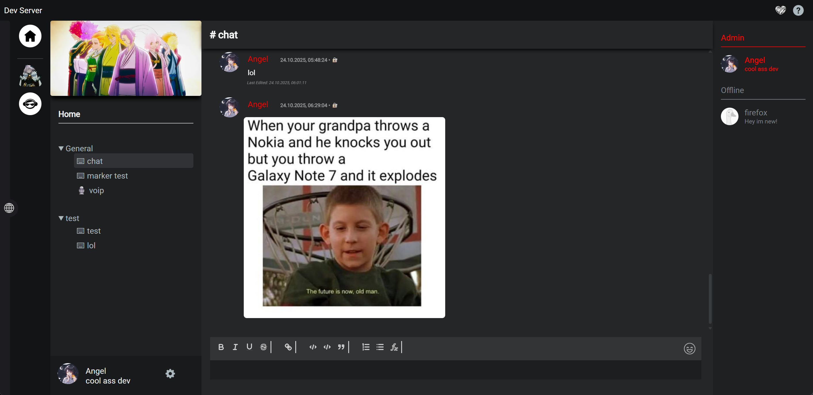

# DCTS - Direct Communication Through Sockets
[](https://ko-fi.com/M4M719FPNG) 

[Visit our subreddit](https://www.reddit.com/r/dcts/) • [Feature list](https://github.com/hackthedev/dcts-shipping/blob/beta/docs/Feature%20List.md) • [Discord for convenience](https://discord.gg/AYq8hbRHNR)

This project was made with the goal to provide a platform that aims to fix issues with existing solutions like Discord, TeamSpeak, Revolt, Fosscord, Matrix, TeaSpeak and all others out there and to create new, advanced and easy to use features while creating as little friction as possible and keeping things intuitive.

Although there are still some rough edges and a few missing features, DCTS is evolving rapidly due to the massive amount of work being put into its development. This includes adding new features as well as refining existing ones or improving the general experience. Compared to other alternatives, DCTS is evolving lightning fast.





------

## Support the Project <3

Without community support, development may slow down significantly and could even come to a halt over time :(

If you value the vision of DCTS and want to see it grow, consider making a donation. Every contribution helps accelerate development and ensures the project's future. Thank you for helping to keep DCTS alive!

[Donate via PayPal](https://www.paypal.me/devilsstore) | [Donate via Ko-fi](https://ko-fi.com/shydevil)

> [!TIP]
>
> You can also support the project by regularly sharing the project and letting as many people know as possible!

------

## Why DCTS?

> [!NOTE]
> DCTS is still in development. Some features may not yet be fully refined.

Modern communication platforms have limitations and issues that DCTS is designed to overcome and fix. Here's why DCTS exists and how it stands out:

- **Encrypted DMs**: DMs are end-to-end encrypted when using the [desktop client](https://github.com/hackthedev/dcts-client-shipping/) and non-encrypted when using the web app as fallback. Despite encryption its possible to report and moderate encrypted messages without compromise![^1]

- **Decentralized In-App Server Discovery**: When using the desktop client, users will share their previously connected servers with the currently connected servers. Servers will sync with other servers and display them seamlessly for both the web and desktop client.

- **Full Data Control**: Self-host your server and take complete control of your data and privacy with ease.

- **Easy to Set Up**: With just two commands (assuming NodeJS & MySQL/MariaDB are installed), you can have your server running.

- **Community-Driven**: Responsive development ensures your feedback and feature requests are heard.

- **Modern and User-Friendly**: Combines a sleek design with an intuitive interface for both casual and advanced users.

- **Highly Customizable**: The plugin system allows endless possibilities for enhancements and features, developed by the community or officially **without** the need of additional hosting.

- **Efficient Media Handling**: Supports advanced features like a Cloudflare image CDN for fast and smooth media uploads and media cache.

- **No Paywalls**: Enjoy full functionality without subscriptions or hidden costs - DCTS is made for everyone.

- **User-Focused**: Designed to prioritize users, not corporations.

- **Future-Proof**: Built with scalability and future features in mind.

DCTS isn't just a chat platform, it's a vision for better communication, driven by simplicity, freedom, and innovation. Its one step out of many to create a new, better web.

> [!TIP]
>
> Checkout the Feature list in `/docs/Feature List.md` if you're curious about more

------

## Installing
### Docker
To install via docker you can either clone and build or use the prebuilt image.
```
sudo docker run --name dcts-server  -p 8080:2052 ghcr.io/hackthedev/dcts-shipping
```
or via docker-compose:
```
curl -L -O https://github.com/hackthedev/dcts-shipping/raw/main/docker/docker-compose.yml
sudo docker compose up -d
```

<br>

### NPM

Requires node.js to be installed, see [Tested Versions](https://github.com/hackthedev/dcts-shipping?tab=readme-ov-file#tested-node-versions). Clone the git repository and execute the following commands inside the app's directory.
```
git clone https://github.com/hackthedev/dcts-shipping --depth 1
npm install
node .
```

> [!TIP]
> Install tutorial: https://www.youtube.com/watch?v=N8ILWcW8vGQ
>
> Auto Installer (wip): https://github.com/hackthedev/initra-shipping

> [!NOTE]
>
> To be able to use all features its required to connect DCTS with MySQL/MariaDB.

------

## Connecting to your server
Once you've installed the server and its running, you can open your browser and enter the server's ip and add the port 2052.<br>
Example: http://localhost:2052<br>
Depending on your configuration the port may vary

------

## Tested Node Versions
- ✔️ v21.7.3
- ✔️ v20.19.2
- ✔️ v18.20.2
- ✔️ v16.16.0
- 🚫 v12.22.9

[^1]: When user A sends user B a message, only user A and B can decrypt the message. When user B reports the message sent by user A, user B creates a report with the encrypted data and decrypted message. Based on the decrypted plain text from user B and public key from user A, its possible to verify the encrypted data by any third party, tho only user A and B can actually decrypt it.
