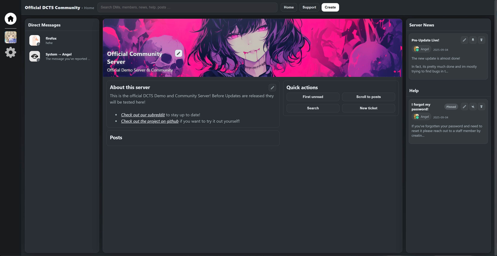
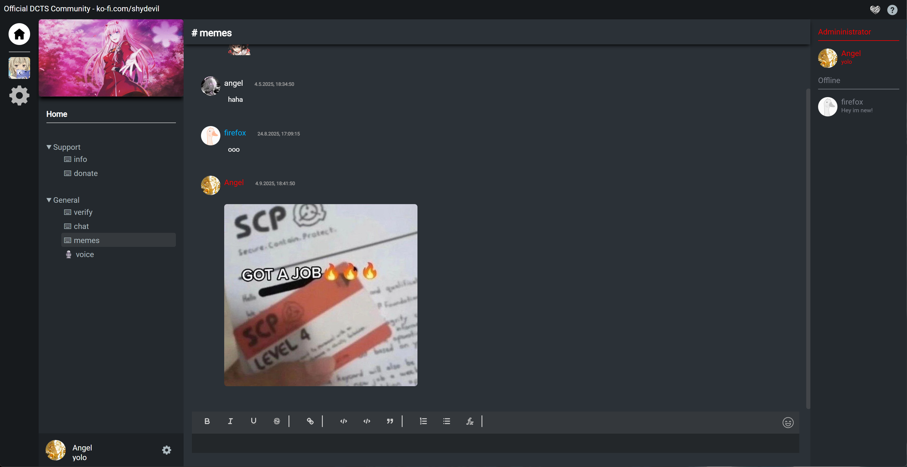

# DCTS - Direct Communication Through Sockets
 

[](https://ko-fi.com/M4M719FPNG)

[Visit our new subreddit](https://www.reddit.com/r/dcts/) • [Feature list](/docs/Feature List.md)


This project was made with the goal to provide a platform that aims to fix issues with existing solutions like Discord, TeamSpeak, Revolt, Fosscord, Matrix, TeaSpeak and all others out there and to create new, advanced and easy to use features while creating as little friction as possible and keeping things intuitive.





<br>

## Support the Project <3
Without community support, development may slow down significantly and could even come to a halt over time :(

If you value the vision of DCTS and want to see it grow, consider making a donation. Every contribution helps accelerate development and ensures the project's future. Thank you for helping us keep DCTS alive and thriving!

[Donate via PayPal](https://www.paypal.me/devilsstore) | [Donate via Ko-fi](https://ko-fi.com/shydevil)

> [!TIP]
>
> You can also support the project by regularly sharing the project and letting as many people know as possible!

<br>

## Why DCTS?

> [!NOTE]
> DCTS is still in development. Some features may not yet be fully refined.

Modern communication platforms have limitations and issues that DCTS is designed to overcome and fix. Here's why DCTS exists and how it stands out:

- **Full Data Control**: Self-host your server and take complete control of your data and privacy.

- **Easy to Set Up**: With just two commands (assuming Node.js is installed), you can have your server running.

- **Community-Driven**: Responsive development ensures your feedback and feature requests are heard.

- **Modern and User-Friendly**: Combines a sleek design with an intuitive interface for both casual and advanced users.

- **Highly Customizable**: The plugin system allows endless possibilities for enhancements and features, developed by the community or officially.

- **Efficient Media Handling**: Supports advanced features like a Cloudflare image CDN for fast and smooth media uploads.

- **No Paywalls**: Enjoy full functionality without subscriptions or hidden costs - DCTS is made for everyone.

- **User-Focused**: Designed to prioritize users, not corporations.

- **Future-Proof**: Built with scalability and future features in mind.

DCTS isn't just a chat platform, it's a vision for better communication, driven by simplicity, freedom, and innovation.

> [!TIP]
>
> Checkout the Feature list in `/docs/Feature List.md` if you're curious about more

<br>

## Installing
### Docker
To install via docker you can either clone and build or use the prebuilt image.
```
sudo docker run --name dcts-server  -p 8080:2052 ghcr.io/hackthedev/dcts-shipping
```
or via docker-compose:
```
curl -L -O https://github.com/hackthedev/dcts-shipping/raw/main/docker/docker-compose.yml
sudo docker compose up -d
```

<br>

### NPM

Requires node.js to be installed, see [Tested Versions](https://github.com/hackthedev/dcts-shipping?tab=readme-ov-file#tested-node-versions). Clone the git repository and execute the following commands inside the app's directory.
```
git clone https://github.com/hackthedev/dcts-shipping --depth 1
npm install
node .
```

> [!TIP]
> Install tutorial: https://www.youtube.com/watch?v=N8ILWcW8vGQ

<br>

## Connecting to your server
Once you've installed the server and its running, you can open your browser and enter the server's ip and add the port 2052.<br>
Example: http://localhost:2052<br>
Depending on your configuration the port may vary

<br>

## Tested Node Versions
- ✔️ v21.7.3
- ✔️ v18.20.2
- ✔️ v16.16.0
- 🚫 v12.22.9
