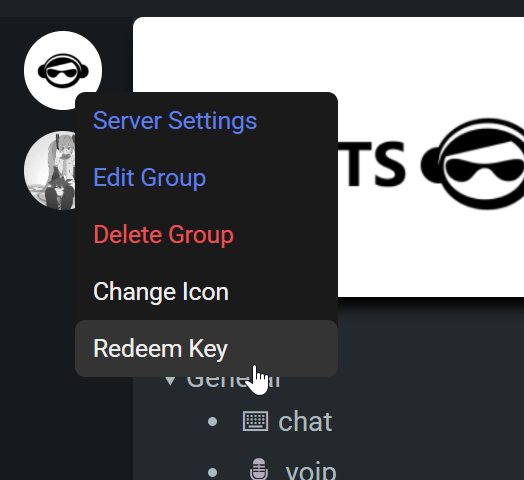

# Getting started

This document explains how to get started with the chat application and explain some concepts. If you ever need help you can make a post on [our subreddit](https://www.reddit.com/r/dcts/).

[TOC]

------

## Requirements & Recommendations

The software was designed to be setup and run as simple as possible. Using the *`config.json`* file you can manage additional settings that are not present in the web client. For example you could configurate a SQL server compatible with MySQL/MariaDB to improve overall functionality **and unlock all the features**.

| Feature                 | Description                                                  |
| ----------------------- | ------------------------------------------------------------ |
| NodeJS                  | Required v16.16.0 and above [^testedNodeVersions]            |
| MySQL-compatible Server | Optional but ***highly*** recommended! Checkout SQL Docs     |
| Tenor                   | Optional, used for GIF search                                |
| SSL                     | Optional for localhost, but ***required for public use***! Checkout SSL Docs<br / |
| LiveKit                 | Used for voice chatting and screen sharing                   |

------

## Installing NodeJS

### Installing on Windows

You can easily install NodeJS by going to the official website at https://nodejs.org/en/download and downloading the *.msi* installer. Once you're done installing you should be able to open a command prompt and entering *`node -v`* should return a version like like *`v18.20.5`*. 

```cmd
Microsoft Windows [Version 10.0.67198.5894]
(c) Microsoft Corporation. 

C:\Users\you_username>node -v
v18.20.5
```

### Installing on Linux

Linux too has more the one way of installing NodeJS. The following commands use nvm (node version manager) to install NodeJS. You can also use nvm to manage node versions. Please check https://nodejs.org/en/download as you can select `linux` to get the latest install instructions.

```bash
# Download and install nvm:
curl -o- https://raw.githubusercontent.com/nvm-sh/nvm/v0.40.3/install.sh | bash

# in lieu of restarting the shell
\. "$HOME/.nvm/nvm.sh"

# Download and install Node.js:
nvm install 24

# Verify the Node.js version:
node -v # Should print "v24.11.0".

# Verify npm version:
npm -v # Should print "11.6.1".
```

All install instructions can be found on the [NodeJS website](https://nodejs.org/en/download) if you need different instructions or if you're having issues installing NodeJS.

------

## Running the app

The chat app was made to be very easy to setup and use. Out of the box it should work without any issues. To start the server on both Windows and Linux, navigate to the app's root directory using a command prompt and start the server using *`node .`*

Example:

```cmd
# Navigate to the project directory
cd /path/to/dcts-shipping

# install all packages, only required on initial setup
npm i

# Start the server
node .
```

As you can see all you really need is one command to launch the chat app if the requirements are already installed. This was made with the goal to be very user friendly and easy to setup and use.

Its possible to use more advanced and better starting methods, such as using docker, a sytem service or supervisor and screen. Information about these can be found in the other documents.

------

## Accessing your chat app

On default your chat app will run on the port 2052. The port can be changed inside the *`config.json`* file under *`serverinfo.port`*. To access the web client you can open a browser and enter http://localhost:2052/, if you're running the chat app locally on your machine.

Of course if you installed and ran the chat app on your server you would need to replace *`localhost`* with the server's ip address or domain.

> [!NOTE]
>
> Its possible to setup a reverse proxy to get rid of the port in the url. Please check the other documents for instructions and carefully read them first!

------

## Getting Administrator permissions

When you open the chat app for the first time in the web client you will be prompted to register for an account. After that you will notice that you're just a normal member. In the console you can find a Server Admin Token.


You can use it to redeem the administrator role in the web client. To do so right click any group and click *`Redeem Key`* like in the screenshot. After entering the key you will receive the Administrator role. 



[^testedNodeVersions]: Checkout Github Repo "Tested Node Versions"