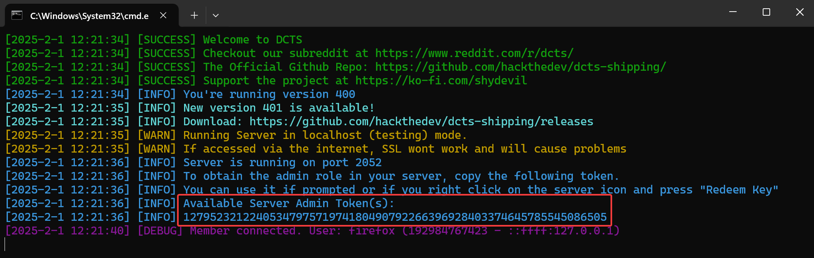
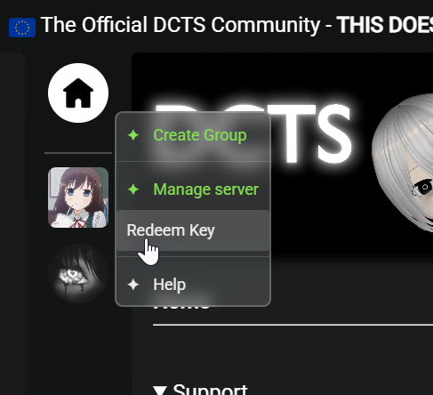

# Getting started

This document explains how to get started with the chat application and explain some concepts. If you ever need help you can make a post on [our subreddit](https://www.reddit.com/r/dcts/).

> [!TIP]
>
> There's now an official [Youtube Tutorial playlist](https://www.youtube.com/watch?v=b1RXJ-ykdgc&list=PL2xF-BCo1FWav36ktSvBG4nDsbhfLkFR-) which is recommended! It will simply the setup massively.

------

## Requirements & Recommendations

The software was designed to be setup and run as simple as possible. Using the *`config.json`* file you can manage additional settings that are not present in the web client. For example you could configurate a SQL server compatible with MariaDB to improve overall functionality **and unlock all the features**.

| Feature        | Description                                                  |
| -------------- | ------------------------------------------------------------ |
| NodeJS / Bun   | In case your machine cant run bun you can also use NodeJS    |
| MariaDB        | ***Required***. **<u>MySQL IS NOT COMPATIBLE</u>**           |
| SSL / TLS Cert | You will need a certificate if you try to access it from another machine/internet due to security reasons! |
| LiveKit        | Used for voice chatting and screen sharing                   |

------

## Installing Bun

Bun has several [install methods on their website.](https://bun.com/docs/installation#docker) You can choose one of the following install methods below

```bash
# maxOS and Linux
curl -fsSL https://bun.com/install | bash

# windows 
powershell -c "irm bun.sh/install.ps1|iex"

# via NodeJS' package manager
npm install -g bun
```

------

## Setting up MariaDB

> [!TIP]
>
> You can setup MariaDB on linux using `apt install mariadb-server mariadb-client -y`.
> For windows and testing only you can use XAMPP

A MariaDB compatible database connection is **required** for DCTS to work.

If you have successfully setup a database server you will need to edit the `sql` section inside the `config.json` file. You **must** set `enabled` to true if thats not the case yet and enter the other information as seen in the example screenshot below. Keep in mind your credentials may be different.

> [!NOTE]
>
> You will need to start the DCTS server at least once for the config file to be generated inside the `configs` folder


> [!TIP]
>
> The default XAMPP username is `root` and the password is empty.

> [!NOTE]
>
> If you use a database user that has enough permissions DCTS can create the database for you as well.


------

## Running the app

The chat app was made to be very easy to setup and use. Out of the box it should work without any issues. To start the server on both Windows and Linux, navigate to the app's root directory using a terminal and start the server using *`bun .`*

Example:

```cmd
# navigate to the project directory
cd /path/to/dcts

# install all packages, only required on initial setup
bun i

# start the server
bun .
```

As you can see all you really need is one command to launch the chat app if the requirements are already installed. This was made with the goal to be very user friendly and easy to setup and use.

Its possible to use more advanced and better starting methods, such as using docker, a sytem service or supervisor and screen. Information about these can be found in the other documents.

>  [!TIP]
>
> Its recommended to use reverse proxies for public access


---

## Accessing your chat app

On default your chat app will run on the port 2052. The port can be changed inside the *`config.json`* file under *`serverinfo.port`*. To access the web client you can open a browser and enter http://localhost:2052/ if you're running the chat app locally on your machine.

Of course if you installed and ran the chat app on your server you would need to replace *`localhost`* with the server's ip address or domain.

> [!NOTE]
>
> Its possible to setup a reverse proxy to get rid of the port in the url. Please check the other documents for instructions and carefully read them first!

> [!CAUTION]
>
> The DCTS web client and desktop client wont work properly if you or anyone will see this message. It means the browser thinks the connection isnt secure and will therefore block important features of the client.
>
> You can usually solve this issue by properly setting up a TLS certificate. A certificate is **required** for public use or use in a local network.
>


------

## Getting Administrator permissions

When you open the chat app for the first time in the web client you will be prompted to register for an account. After that you will notice that you're just a normal member. In the console you can find a Server Admin Token.



You can use it to redeem the administrator role in the web client. To do so right click any group and click *`Redeem Key`* like in the screenshot. After entering the key you will receive the Administrator role. 



> [!NOTE]
>
> You'll need to configure and install the software needed for Voice Chatting and Screensharing yourself as of right now. Please checkout `VoIP Setup.md` inside the `docs` folder. It will also contain a recommended DNS setup.

> [!TIP]
>
> You can create a new admin token by typing `token 1111` into the DCTS console window, whereas `1111` is the role id, in this case the admin role id.

[^testedNodeVersions]: Checkout Github Main Readme "Tested Versions"