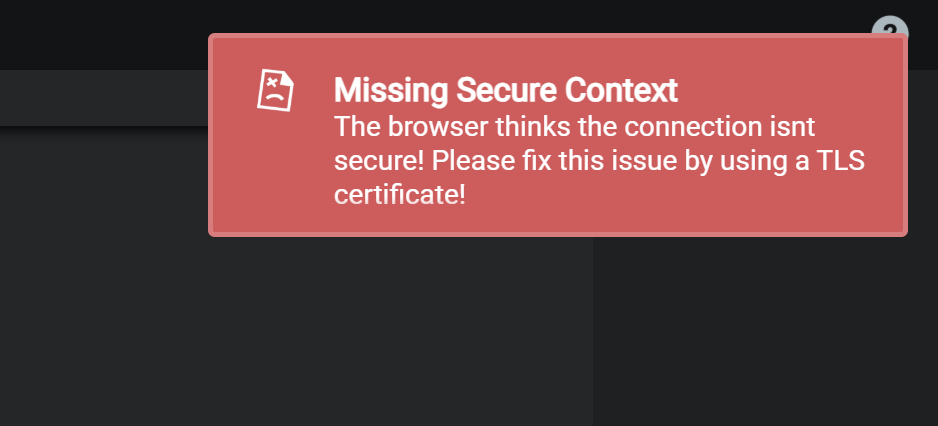
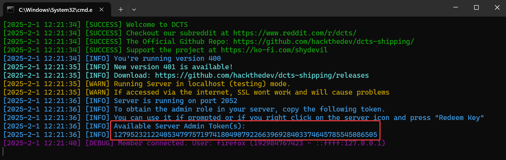
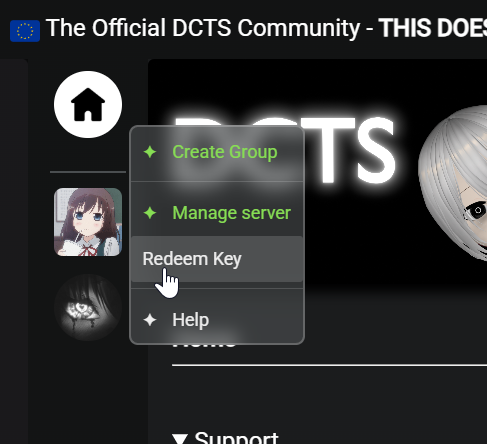

# Getting started

This document explains how to get started with the chat application and explain some concepts. If you ever need help you can make a post on [our subreddit](https://www.reddit.com/r/dcts/).

> [!TIP]
>
> There's now an official [Youtube Tutorial playlist](https://www.youtube.com/watch?v=b1RXJ-ykdgc&list=PL2xF-BCo1FWav36ktSvBG4nDsbhfLkFR-) which is recommended! It will simply the setup massively.

> [!Warning]
>
> Always stop the server before editing the *`config.json`* file. Data may be overwritten otherwise! It will be automatically generated when you launch the DCTS server once.

------
## Requirements & Recommendations

The software was designed to be setup and run as simple as possible. Using the *`config.json`* file you can manage additional settings that may not be present in the web client. 

| Feature        | Description                                                                                                                                                             |
| -------------- | ----------------------------------------------------------------------------------------------------------------------------------------------------------------------- |
| NodeJS / Bun   | Bun is the preferred runtime. Alternatively NodeJS can be used as well.                                                                                                 |
| MariaDB        | ***Required***. **<u>MySQL IS NOT COMPATIBLE</u>**                                                                                                                      |
| SSL / TLS Cert | You will need a certificate if you try to access it from another machine/internet due to security reasons! Its fine for localhost only                                  |
| Caddy / nginx  | Used for reverse proxies to make life easier and when you want your instance to be accessable from other computers.                                                     |
| Docker         | Required.                                                                                                                                                               |
| vCPU           | If you plan to run DCTS on a VPS, make sure the VPS provider supports `host` as cpu type. Need a vps still? [Checkout our partner](https://vultris.cloud/)              |
| Domain         | For public access you will need to own a domain with at least 2 sub domains. You wont be able to pass the setup without it. More in [DNS Setup](network/DNS%20Setup.md) |

Additionally, the following ports are being used and should be accessable if you dont use a [Reverse Proxy Setup](network/Reverse%20Proxy%20Setup.md) .
- 2052:2052
- 5000:5000
- 7880:7880
- 7881:7881
- 7882:7882
- 3478:3478
- 5349:5349

> [!TIP]
> If you want to follow this tutorial make sure the following is installed:
> ```bash
> apt install curl -y
> apt install unzip -y
> apt install wget -y
> ```
> Docker install instructions can be found on their website: 
> https://docs.docker.com/engine/install/

> [!WARNING]
> If you run DCTS using docker on a VPS system make sure it supports certain CPU features, otherwise you will run into compatibility issues! You can check if your system is compatible using the following command:
> ```bash
> grep -qw sse4_2 /proc/cpuinfo && echo true || echo false
> ```
> 
> At a minimum you will need `sse4_2`, idealy `avx` and `avx2`. If you use a modern system you should be fine.  **VPS Systems from out partner**  [vultris](https://vultris.cloud/) offer such systems.

------

## Installing

You can download, install and run DCTS with only a few commands using docker.

```bash
curl -fsSL https://raw.githubusercontent.com/hackthedev/dcts-shipping/main/Docker/docker-compose.yml -o docker-compose.yml

sudo docker compose up -d
```

---

## Setup

If you dont see the DCTS server logs already, you'll need to view them with the following command. The logs will show an url for the setup wizard on first run which you will need to enter in your web browser.

```bash
sudo docker logs -f dcts
```

```
[2026-09-16 19:28:11] [SUCCESS] Setup Page is available at:    
[2026-09-16 19:28:11] [SUCCESS] http://localhost:5000/wizard/afc6dae7-dc42-4bc9-aa8c-79bbcbe8c471/    
[2026-09-16 19:28:11] [WARN] Copy the url to continue the setup process.
```

> [!NOTE]
> You may need to replace the `localhost` part with an actual ip address or domain depending on your setup. Also make sure to not connect using https://, only with http://

---
## Accessing

After you have successfully finished the setup using the new setup wizard you should be automatically redirected. If you have used a valid domain it should be accessable via the address you provided.

If you are running DCTS locally on your system without public access and a domain you may need to enter http://localhost:2052 in your browser.


---
### Running the dev version

Alternatively, you can also run the dev version which has experimental features and possible bug fixes. Usually you dont need to use it unless you want to help test things.

```bash
curl -fsSL https://raw.githubusercontent.com/hackthedev/dcts-shipping/dev/Docker/docker-compose.yml -o docker-compose.yml

sudo VERSION=dev docker compose up -d --pull always
```


> [!TIP]
> Here are some helpful docker commands!
> 
> ```bash
> sudo docker exec -it dcts bash # open a shell in the container
> sudo docker restart dcts # restarts the container
> sudo docker stop dcts # stops the container
> sudo docker logs -f dcts # shows live logs from the container
> sudo docker rm dcts # will delete the container if stopped.
> ```


---

## Accessing your chat app

On default your chat app will run on the port 2052. The port can be changed inside the *`config.json`* file under *`serverinfo.port`* or with docker. To access the web client you can open a browser and enter http://localhost:2052/ if you're running the chat app locally on your machine.

Of course if you installed and ran the chat app on your server you would need to replace *`localhost`* with the server's ip address or domain. 

> [!IMPORTANT]
> For public access you will need a TLS certificate! This is where caddy becomes relevant. If you installed DCTS on another machine you will need to setup caddy/nginx with TLS certs before progressing from this point on. Checkout [Caddy Setup](network/Caddy%20Setup.md).

> [!NOTE]
> Its possible to setup a reverse proxy to get rid of the port in the url. Please check [Reverse Proxy Setup](network/Reverse%20Proxy%20Setup.md) for instructions and carefully read them first!

> [!CAUTION]
> The DCTS web client and desktop client wont work properly if you or anyone will see this message. It means the browser thinks the connection isnt secure and will therefore block important features of the client.
>
> Check the above notice for public access.
>



------

## Getting Administrator permissions

When you open the chat app for the first time in the web client you will be prompted to register for an account. After that you will notice that you're just a normal member. In the console you can find a Server Admin Token.



You can use it to redeem the administrator role in the web client. To do so right click any group and click *`Redeem Key`* like in the screenshot. After entering the key you will receive the Administrator role. 



> [!TIP]
>
> You can create a new admin token by typing `token 1111` into the DCTS console window, whereas `1111` is the role id, in this case the admin role id.
> 
> Checkout the docker tips at [Running DCTS](#Running%20DCTS) on how to view the console log.

---

## Going Public

If everything works locally and you want to go public now so others can access it too then go checkout [Reverse Proxy Setup](network/Reverse%20Proxy%20Setup.md). You will also need a public domain thats secured with a TLS certificate. We recommend using caddy.


[^testedNodeVersions]: Checkout Github Main Readme "Tested Versions"