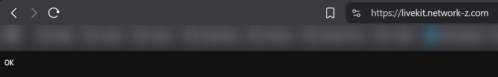
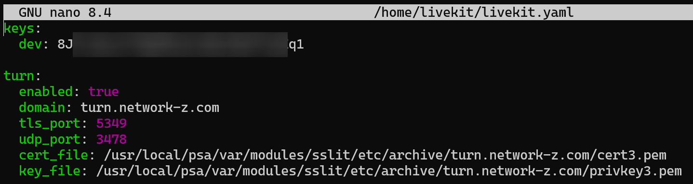

# VoIP Setup

At the time of writing the entire VoIP Code and Setup has been completely rewritten in order to improve on stability and scalability. Setting up VoIP requires a bit of initial work.

The following document is based on the setup of the official instance and works pretty flawless once setup.

> [!TIP]
>
> If you use linux and want to run DCTS on a proper server you could install and use Plesk on your server to have an easier time with managing sub domains and reverse proxy setups. Personally i'd recommend it as i dont wanna manually deal with config files etc.

------

## DNS Setup

Its recommended to create two subdomains for the VoIP system to make things easier. The subdomains are used for the reverse proxies and they should point to the server where you run DCTS and livekit.

| Type | Name    | Content             | Proxy needed? |
| ---- | ------- | ------------------- | ------------- |
| A    | livekit | your.public.ip.here | Yes           |
| A    | turn    | your.public.ip.here | No            |

> [!WARNING]
>
> Please note that you will need to have valid TLS certificates for your subdomains and access to the cert files as they will be needed later for the configuration of livekit.

------

## LiveKit Reverse Proxy Setup

```nginx
location / {
	proxy_pass http://127.0.0.1:7880/;
	proxy_http_version 1.1;

	add_header Access-Control-Allow-Origin *;
	add_header Access-Control-Allow-Methods "GET, POST, OPTIONS";
	add_header Access-Control-Allow-Headers "*";

	proxy_set_header Upgrade $http_upgrade;
	proxy_set_header Connection "upgrade";
	proxy_set_header Host $host;
	proxy_set_header X-Real-IP $remote_addr;
	proxy_set_header X-Forwarded-For $proxy_add_x_forwarded_for;
	proxy_set_header X-Forwarded-Proto $scheme;
}
```

> [!TIP]
>
> You can verify if livekit works by entering your subdomain in a browser and check if you'll see `OK` like in the screenshot below, given you've already installed livekit and its running.



------

## LiveKit Service Config Setup

This step assumes you've already installed livekit on your server with the install instructions found in the readme file. If thats the case, you should find a livekit config file inside the `/home/livekit` folder called `livekit.yaml`, like in the screenshot below.

Its important that you set `enabled` to `true`, and change the `domain` value to the domain you're using and linking the TLS certificate files. After you've setup the config file you can exit your editor of choice and restart livekit using `service livekit restart`.



> [!NOTE]
>
> Turn and TLS is required if you want others to be able to connect to VoIP. Its used for both talking and screensharing.

> [!TIP]
>
> You can try and find errors by viewing the livekit log using `sudo journalctl -u livekit -f`. Both the desktop and web client will show logs inside the Web Dev Console (CTRL + Shift + i). 

------

## LiveKit DCTS Config Setup

Inside the `config.json` file in your DCTS root folder, you will find a section for livekit. This is where you set it to enabled and enter the other relevant data found inside the `livekit.yaml` file from the previous step. Once everything is set VoIP and Screensharing should work flawlessly now.


> [!WARNING]
>
> Before editing **anything** inside the config file manually, makes sure to stop the server, as your changes may get lost.