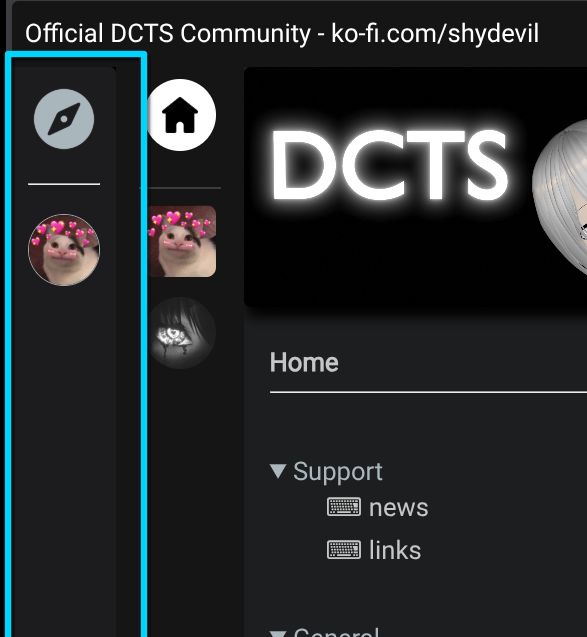

# Server List

The server list is a decentralized list that will display all servers known to the instance you're on, and if you use the desktop client it will add all the remaining servers you know as well. You can get a better view about these servers by clicking the discovery icon.

The list will automatically show itself by hovering over the globe icon or the list itself.

> [!NOTE]
>
> As of right now, the server list will show all servers without visiting the discovery page. This will be changed in the future to only show servers you've marked as favourite.

Instances can moderate and choose which servers are shown and which ones will be hidden. Depending on the instance you're on, they may show different servers if any. If instances know each other and synching is enabled *(it is by default)* they will automatically sync.

