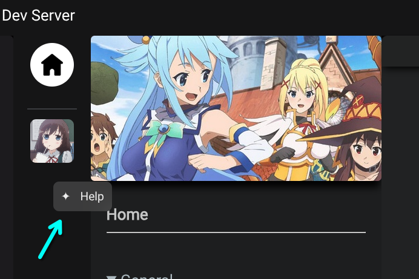

# Document Viewer

The document viewer is a small feature that has been added to provide a way to properly view the `.md` files without me having to export all the docs as PDF/HTML files or users having to navigate to github. In addition the document viewer can be used to show help pages and tutorials.

------

## Showing help docs

You'll be able to right click certain parts of the app and if it shows a `Help` button it'll open the document viewer with the correct page. You may get to see hints in forms of click-able text like hyperlinks and similar.

